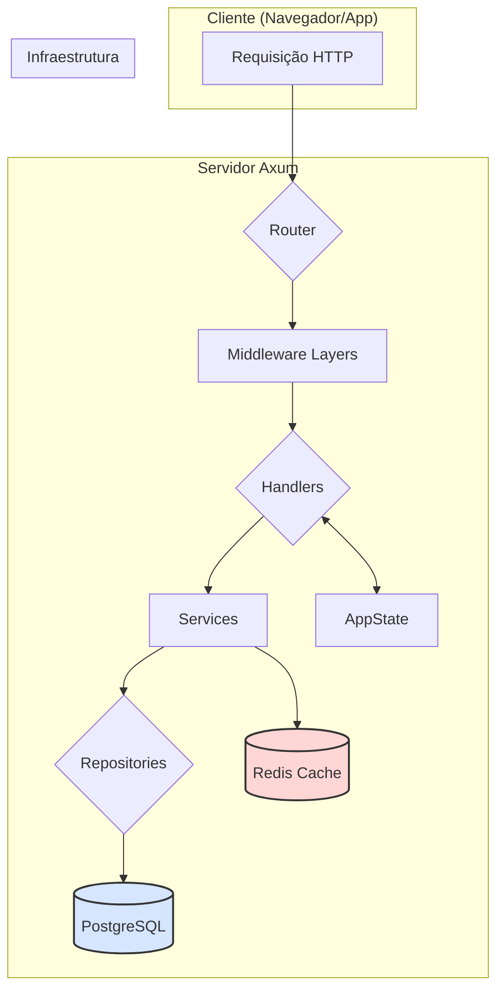
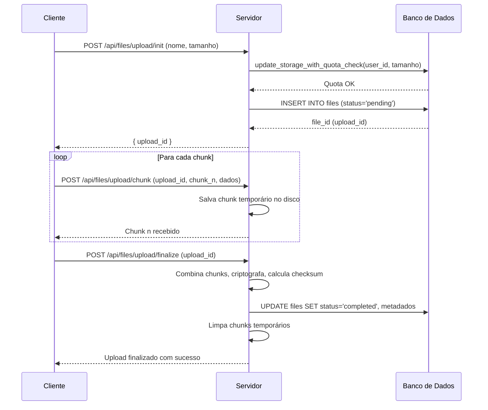

# Arquitetura do Sistema

Este documento descreve a arquitetura geral do backend, as decisões de design, os padrões utilizados e os fluxos de dados para as operações principais.

## 1. Visão Geral da Arquitetura

O sistema é construído em **Rust** utilizando uma arquitetura de serviços moderna, performática e segura. O design é modular e segue o princípio de separação de responsabilidades para facilitar a manutenção e escalabilidade.

### Componentes Principais:

-   **Web Framework**: **Axum** é utilizado como o framework web principal, escolhido por sua integração com o ecossistema `tokio`, segurança de tipos e sistema de extração flexível.
-   **Runtime Assíncrono**: **Tokio** é a fundação para todas as operações assíncronas, garantindo alta concorrência e utilização eficiente de recursos.
-   **Banco de Dados**: **PostgreSQL** é o banco de dados relacional, acessado através de um pool de conexões otimizado (`deadpool-postgres`).
-   **Cache**: **Redis** é utilizado para cache de dados críticos, como as chaves de criptografia (KEK), para reduzir a latência de operações criptográficas.
-   **Estado da Aplicação**: Um `AppState` compartilhado e thread-safe (`Arc<AppState>`) injeta dependências (pools de conexão, configuração) nos handlers, seguindo o padrão de injeção de dependência.
-   **Middleware**: A segurança e o processamento de requisições são organizados em camadas (`Layers`) de middleware, incluindo CORS, tracing, rate limiting, autenticação e verificação de CSRF.

### Diagrama de Arquitetura de Alto Nível

## 2. Fluxos de Dados

### Fluxo de Registro de Usuário

1.  **Requisição**: O cliente envia uma requisição `POST /api/auth/register` com nome, username, email e senha.
2.  **Rate Limiting**: O middleware `rate_limit_register` verifica se o IP excedeu o limite de tentativas.
3.  **Validação**: O handler `handlers::auth::register` valida os dados de entrada usando `garde`.
4.  **Hashing de Senha**: O `services::auth` gera um hash seguro da senha usando **Argon2**.
5.  **Criação da DEK**: Uma nova Data Encryption Key (DEK) é gerada para o usuário.
6.  **Criptografia da DEK**: A DEK é criptografada com uma chave derivada da senha do usuário.
7.  **Persistência**: O `repositories::user` insere o novo usuário no banco de dados, armazenando o hash da senha e a DEK criptografada.
8.  **Resposta**: O servidor retorna uma resposta de sucesso.

### Fluxo de Upload de Arquivo (Chunked)

Este fluxo é projetado para lidar com arquivos grandes de forma eficiente e resiliente.

1.  **Init Upload (`/api/files/upload/init`)**:
    *   O cliente informa o nome e o tamanho do arquivo.
    *   O servidor verifica a cota de armazenamento do usuário de forma atômica usando a função `update_storage_with_quota_check` no PostgreSQL.
    *   Se houver espaço, o servidor cria um registro de arquivo com status `pending` e retorna um `upload_id`.

2.  **Upload Chunk (`/api/files/upload/chunk`)**:
    *   O cliente envia os chunks do arquivo em requisições `POST`, incluindo o `upload_id` e o número do chunk.
    *   O servidor armazena os chunks temporariamente no disco, em um diretório associado ao `upload_id`.

3.  **Finalize Upload (`/api/files/upload/finalize`)**:
    *   Após enviar todos os chunks, o cliente envia uma requisição de finalização.
    *   O servidor verifica se todos os chunks foram recebidos, os combina no arquivo final e calcula o checksum (SHA-256).
    *   O arquivo é criptografado com a DEK do usuário.
    *   O registro do arquivo no banco de dados é atualizado para o status `completed`, e os metadados (checksum, nonce, etc.) são salvos.
    *   Os chunks temporários são excluídos.

#### Diagrama do Fluxo de Upload

## 3. Decisões de Design e Padrões

### Performance-First

-   **Allocator `jemallocator`**: Substitui o alocador de memória padrão do sistema por `jemalloc`, que é otimizado para cenários de alta concorrência e pode reduzir a fragmentação de memória, resultando em ganhos de performance de 15-20%.
-   **JSON com `sonic-rs`**: Utiliza a biblioteca `sonic-rs`, uma implementação em Rust de uma biblioteca de serialização JSON de alta performance, que pode ser até 3x mais rápida que `serde_json` em certos cenários.
-   **Pool de Conexões Otimizado**: `deadpool-postgres` é usado para gerenciar um pool de conexões com o PostgreSQL, minimizando a latência associada à criação de novas conexões a cada requisição.
-   **Compilação `production`**: O perfil `[profile.production]` em `Cargo.toml` é configurado com otimizações agressivas (LTO, codegen-units=1, strip) para gerar um binário final menor e mais rápido.

### Segurança em Camadas

-   **Criptografia End-to-End (E2E)**: O sistema implementa um modelo de criptografia forte onde os arquivos são criptografados no servidor com uma chave (DEK) que só o usuário pode descriptografar com sua senha. Uma KEK (Key Encryption Key) rotacionável, protegida por uma chave mestra, adiciona uma camada extra de segurança.
-   **Prevenção de Race Conditions**: A função `update_storage_with_quota_check` no PostgreSQL utiliza `SELECT FOR UPDATE` para criar um lock a nível de linha, garantindo que a verificação de cota e a atualização do uso de armazenamento sejam uma operação atômica, prevenindo vulnerabilidades de Time-of-check to time-of-use (TOCTOU).
-   **Middleware de Segurança**:
    -   `tower_governor`: Implementa rate limiting com base em IP para mitigar ataques de força bruta.
    -   **CSRF Protection**: Um middleware customizado implementa o padrão *double submit cookie* para proteger contra ataques de Cross-Site Request Forgery.
    -   **Auth Middleware**: Rotas protegidas são guardadas por um middleware que valida a sessão do usuário, garantindo que apenas usuários autenticados possam acessar recursos restritos.

### Manutenibilidade e Escalabilidade

-   **Arquitetura Modular**: O código é organizado em módulos com responsabilidades claras (`handlers`, `services`, `repositories`, `models`), facilitando a navegação, testes e a adição de novas funcionalidades.
-   **Tratamento de Erros Centralizado**: O tipo `error::AppError` unifica o tratamento de erros em toda a aplicação, permitindo a conversão de diferentes tipos de erro em respostas HTTP consistentes e significativas.
-   **Configuração Centralizada**: A struct `config::Config` carrega todas as configurações a partir de variáveis de ambiente, permitindo uma fácil configuração para diferentes ambientes (desenvolvimento, teste, produção).
