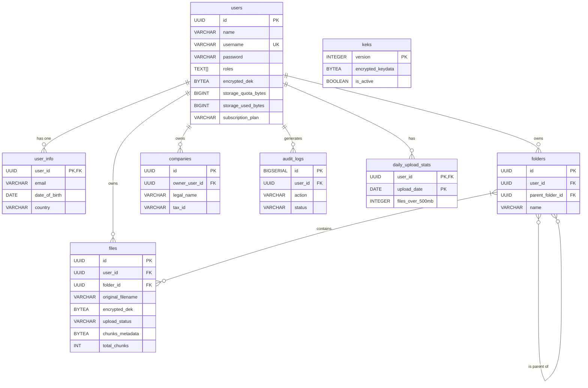

# Documentação do Banco de Dados

Este documento fornece uma análise detalhada do schema do banco de dados PostgreSQL, incluindo tabelas, relacionamentos, índices e estratégias de otimização.

## 1. Diagrama de Entidade-Relacionamento (ERD)

O diagrama abaixo ilustra as principais tabelas e seus relacionamentos.

## 2. Schema das Tabelas

A seguir, uma descrição detalhada de cada tabela, baseada nas migrações.

### Tabela `users`

Armazena as informações centrais dos usuários, incluindo credenciais, quota de armazenamento e metadados de criptografia.

-   **`id` (PK)**: Identificador único do usuário.
-   **`username` (UK)**: Nome de usuário único para login.
-   **`password`**: Hash da senha gerado com Argon2.
-   **`encrypted_dek`**: Data Encryption Key (DEK) do usuário, criptografada com uma chave derivada da senha.
-   **`storage_quota_bytes`**: Quota máxima de armazenamento em bytes, determinada pelo `subscription_plan`.
-   **`storage_used_bytes`**: Espaço de armazenamento atualmente utilizado.
-   **`subscription_plan`**: Nível de assinatura do usuário (ex: 'free', 'pro').
-   **Constraints**: `check_storage_quota` garante que `storage_used_bytes` não exceda `storage_quota_bytes`.

### Tabela `files`

Repositório de metadados para cada arquivo armazenado no sistema.

-   **`id` (PK)**: Identificador único do arquivo.
-   **`user_id` (FK)**: Referência ao usuário proprietário do arquivo.
-   **`folder_id` (FK)**: Referência à pasta que contém o arquivo (pode ser nulo para arquivos na raiz).
-   **`original_filename`**: Nome original do arquivo no momento do upload.
-   **`upload_status`**: Estado do upload (`pending`, `completed`, `failed`).
-   **`chunks_metadata`**: Metadados sobre os chunks do arquivo, serializados com `bincode`, para reconstrução.
-   **`total_chunks`**: Número total de chunks que compõem o arquivo.
-   **`is_deleted` / `deleted_at`**: Suporte a soft delete.

### Tabela `folders`

Define a estrutura de diretórios hierárquica para organização de arquivos.

-   **`id` (PK)**: Identificador único da pasta.
-   **`user_id` (FK)**: Referência ao usuário proprietário.
-   **`parent_folder_id` (FK)**: Chave auto-referencial para criar a hierarquia. Nulo para pastas na raiz.
-   **`name`**: Nome da pasta.
-   **Constraints**: `check_folder_name_not_empty` impede nomes vazios.

### Tabela `keks`

Armazena as Key Encryption Keys (KEK), que protegem as DEKs dos usuários.

-   **`version` (PK)**: Versão da KEK. Permite a rotação de chaves.
-   **`encrypted_keydata`**: KEK criptografada com a chave mestra da aplicação.
-   **`is_active`**: Indica se a chave é usada para novas criptografias.
-   **`is_deprecated`**: Indica que a chave não deve mais ser usada.

### Tabela `audit_logs`

Registra eventos de segurança importantes para auditoria e monitoramento.

-   **`id` (PK)**: Identificador do log.
-   **`user_id` (FK)**: Usuário que realizou a ação.
-   **`action`**: Ação realizada (ex: 'login', 'file_upload').
-   **`status`**: Resultado da ação (`success`, `failure`).
-   **`ip_address`**, **`user_agent`**: Metadados da requisição.

## 3. Estratégias de Otimização e Segurança

### Índices

O banco de dados utiliza uma estratégia de indexação abrangente para otimizar as consultas mais comuns:
-   **Índices Compostos**: Como `idx_users_username_active` e `idx_folders_parent_user`, para acelerar consultas com múltiplos filtros.
-   **Índices Parciais (Partial Indexes)**: Como `WHERE is_active = true`, que criam índices menores e mais eficientes para subconjuntos de dados frequentemente acessados.
-   **Índice de Hash**: `idx_files_chunks_metadata` utiliza um índice de hash para buscas de igualdade exata nos metadados dos chunks, que é mais eficiente para esse tipo de dado do que um B-Tree.

### Funções e Gatilhos (Triggers)

-   **`update_storage_with_quota_check()`**: Função PL/pgSQL crítica que **atomicamente** verifica a cota e atualiza o armazenamento usado. Utiliza `SELECT FOR UPDATE` para bloquear a linha do usuário, prevenindo **race conditions** e vulnerabilidades TOCTOU, onde um atacante poderia explorar o tempo entre a verificação e a atualização para exceder a cota.
-   **`rollback_storage_usage()`**: Garante que o espaço de armazenamento seja devolvido atomicamente em caso de falha no upload.
-   **`update_quota_on_plan_change()`**: Um gatilho que ajusta automaticamente a `storage_quota_bytes` quando o `subscription_plan` de um usuário é alterado, garantindo consistência dos dados.
-   **`update_updated_at_column()`**: Um gatilho genérico que atualiza o campo `updated_at` em qualquer modificação de linha, simplificando a lógica de auditoria.

### Manutenção e Performance

-   **`autovacuum` Agressivo**: As configurações de `autovacuum` para tabelas de alta volatilidade (como `files` e `audit_logs`) foram ajustadas para serem mais agressivas (valores menores para `autovacuum_vacuum_scale_factor`). Isso garante que o "lixo" (tuplas mortas) seja limpo mais frequentemente, mantendo a performance das consultas e prevenindo o inchaço da tabela (*table bloat*).
